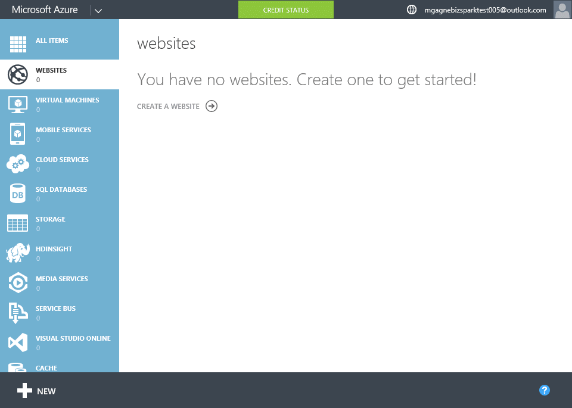

[[Home]](../../README.html)

# Creating a Website with FTP

## Prepping your machine

### FTP Client

You can use any FTP client for this demo. If you don't have one try [FileZilla](https://filezilla-project.org/download.php?show_all=1).

## Guide

1. Click `+NEW` > `WEBSITE` > `QUICK CREATE`
1. Enter required information
	* Unique website name
	* Create a new hosting plan or use an existing one (you can simply use the default selection)
	* Select your region (you can simply use the default selection)
1. *Speaker*: "Azure is now configuring a blank website for you"
1. Click on the website you just created
1. Click `Set up deployment credentials`
	* Enter a unique username & password
	* Click `OK` (checkmark)
	* *Speaker*: "Your username must be unique"
	* *Speaker*: "You can come back here anytime to come back and reset your deployment credentials"
1. Click `DASHBOARD`
1. Scroll down and zoom in to show the FTPS host name & user
	* **Tip**: You can use the built in Windows magnifier (`Windows Key` + '+' / `Windows Key` + '-') or the very popular and handy [ZoomIt](https://technet.microsoft.com/en-us/sysinternals/bb897434) which also allows for drawing arrows/boxes on the screen.
1. Launch your FTP Client (this demo uses FileZilla).
1. Enter the FTP Host Name, Username & Password and connect
	* If promoted to accept certificates do so
1. In your FTP client navigate the remote directory to `/site/wwwroot`
1. Delete the file 'hostingstart.html'
	* *Speaker*: "Explain that Azure automatically creates your sites with this placeholder file."
1. In your FTP client navigate to the local directory that contains the website you wish to upload. This can be any site/app (.NET/PHP/Node.js/HTML etc.). If you don't have one you can use the site found in `Azure Websites Deployment Slots/assets/coming-soon-demo-prod`
1. Drag & Drop the local folder into the remote folder (upload the site)
1. Once done uploading go back to the Azure Portal and click `Browse` on your site to show that it's been uploaded.
1. *Speaker*: "FTP is a great way to get your site uploaded quickly however there are a number of better ways including using integrated source control for continuous deployment which we will also demo."

