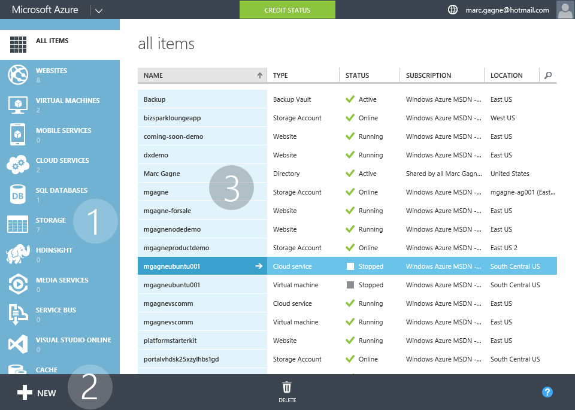
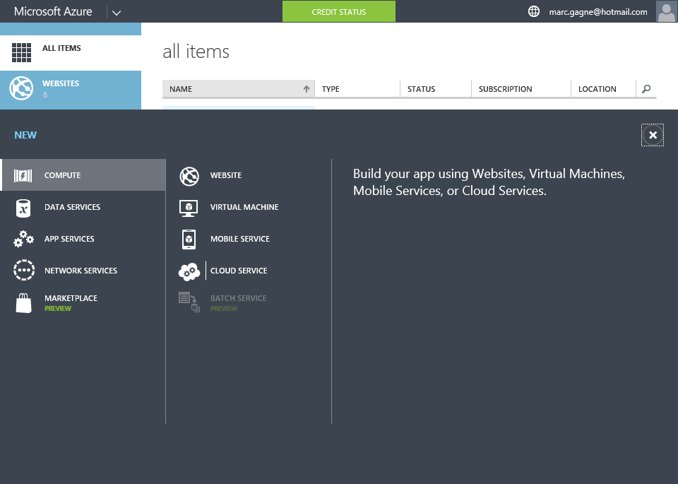

[[Home]](../../README.html)

#Current & Preview Portal Overview

## Notes

* Explain that there are two version of the portal
	* The current on which is available here: https://manage.windowsazure.com
	* The preview portal aka "New Portal" which is available here: https://portal.azure.com/
* All demos (unless using preview features) will be based on the current portal

## Interface Overview

1. List of services available on Azure
	* **Speaker tips**: Mention a few of them and explain that Azure includes 50+ services such as
		* Virtual Machines (Windows & Linux)
		* Websites
		* Mobile Services (iOS, Android, Windows, Web, etc.)
		* SQL, DocumentDB, Cache, Search etc.
		* HDInsight
		* Machine Learning
		* Stream Analytics
		* Virtual Networks
		* Azure Active Directory
		* Media Services
		* CDN
2. Quickest and easiest way to create new services/infrastructure on Azure
3. List of your configured services on Azure

## Adding New Services

Since we will be working with Websites in the rest of the demo, It's a good idea to show how easy it is to add other things like a Virtual Machine right from the portal, which in turn gives a brief overview of the mechanics of the portal. Don't worry about completely adding a new Virtual Machine however do follow the wizard to create one and explain that once finished their server will be available in 5-6 minutes.

### Guide

* *Speaker*: "Adding new services/infrastructure is easy"
* Click on `+ NEW`
* Click on `Virtual Machines`
* *Speaker*: "you can quickly create a new server or select one from the gallery"
* Click `From Gallery`
* *Speaker*: "There are many images to chose from including Windows Server, popular Linux distros (distributions) like Ubuntu, CentOS & Suse even Puppet servers"
* *Speaker*: "We are not going to be creating virtual machines in this demo, but this gives you an idea of some of the other things you can do with Azure"
