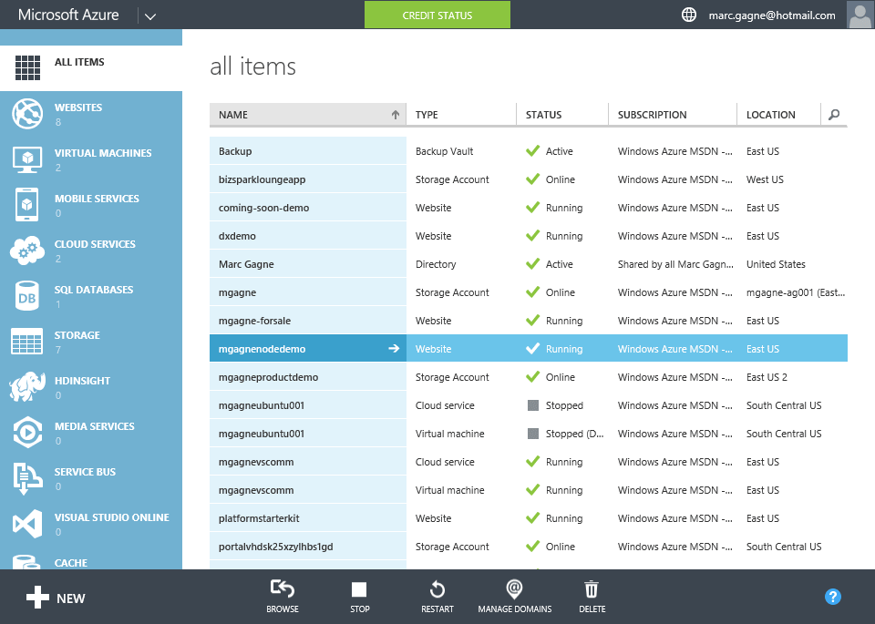
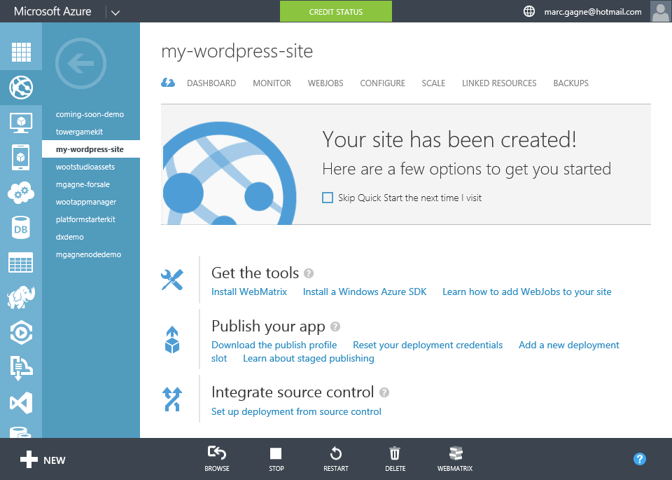

[[Home]](../../README.html)

# Wordpress Demo

## Guide

1. Click `NEW`
1. Click `WEBSITE`
1. Click `FROM GALLERY`
1. Scroll through the list of frameworks, blogs & other gallery items
	* *Speaker*: "The gallery contains a number of popular web applications and frameworks and makes it easy to deploy with with just a few clicks. This includes blogs such as Orchard CMD, Umbraco & of course Wordpress, but also CMSs like Drupal & Acquia, ecommerce platforms, forums, image galleries and more."
1. Click `BLOGS` then `Wordpress`
	* *Speaker*: "The Azure team will automatically deploy and configure the latest Wordpress release"
1. Configure Wordpress - Step 1
	* `URL`: enter a unique name
	* `DATABASE`: If you haven't yet created a MySQL database select "Create a new MySQL database" otherwise select "Use Existing MySQL database"
	WEBSCALEGROUP:
		* Chose the default option, however explain what a web scale group is.
		* *Speaker*: "Azure allows you to groups sites together. So certain sites could all be allocated to a certain size server, where as others can be assigned to a different cluster with a different scale."
	* Deployment Settings:
		* *Speaker*: "Wordpress can be made more secure by providing 4 authentication keys and 4 hashing salts. What are these? it's random bits of data that when combined add an extra layer of security to your passwords and data stores in cookies. Wordpress has a random key generator you can use found at aka.ms/wordpresskeys or by searching for 'wordpress key generator'"
		* Show them the key generator at http://aka.ms/wordpresskeys but don't bother entering them into the Azure wizard
	* Click `Next` (Right arrow)
1. Configure Wordpress - Step 2
	* Depending of your selection for creating a new MySQL database or reusing an existing one this screen will be slightly different. Either way there is nothing for you to do other than to accept the ClearDB's legal terms at the bottom.
	* *Speaker*: "Azure will automatically create your website to host Wordpress as well as create & manage a MySQL database which is required by Wordpress. This "MySQL as a Service" is hosted on Azure but managed by ClearDB as they are better equipped at managing MySQL then Microsoft, which is why you have to agree to their terms and conditions. You can if you wish create a MySQL server using Virtual Machines and connect that to your website but that scenario won't be covered by this demo.""
	* Click `OK` (Checkmark)
1. *Speaker*: "Azure is now either creating your web server or connecting to one it has already created for you, setting up IIS with PHP, installing the latest version of Wordpress, creating a database for you, setting it up. In short it's auto-magically setting up everything for you so you don't have to worry about servers, databases, connection strings, configuring PHP etc. This will take about 30 seconds to a minute."
1. Once the site has been created click on it and then click `Browse` to show that it's now ready to be configured with their language & administrative account etc.

** Optional **
If you have time you can also show deleting a Wordpress site and explain the concept of linked resources.

1. In the Dashboard for your new Wordpress site in Azure click `DELETE`
1. In the "MySQL" Database Warning" popup. [x] select the associated database
	* *Speaker*: "When Azure creates and manages services like this for you it automatically links resources so you can manage them together. In this case it's prompting you to delete the linked database."
1. Close the prompt (Do NOT delete the site)
1. Click the `LINKED RESOURCES` tab to show the currently configured linked resources
1. Click `LINK` 
1. *Speaker*: "Here you can either add new or link to existing resources such as SQL Databases & Storage Accounts. This is helpful to keep resources together for management purposes. Imagine having 10's or even 100's of websites and not knowing which database or storage account belongs to which."