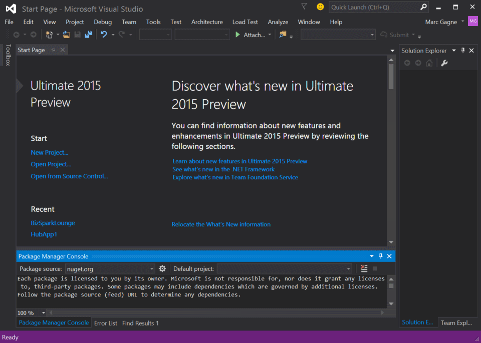
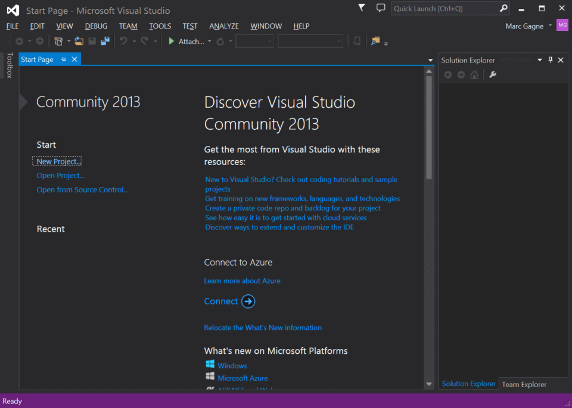
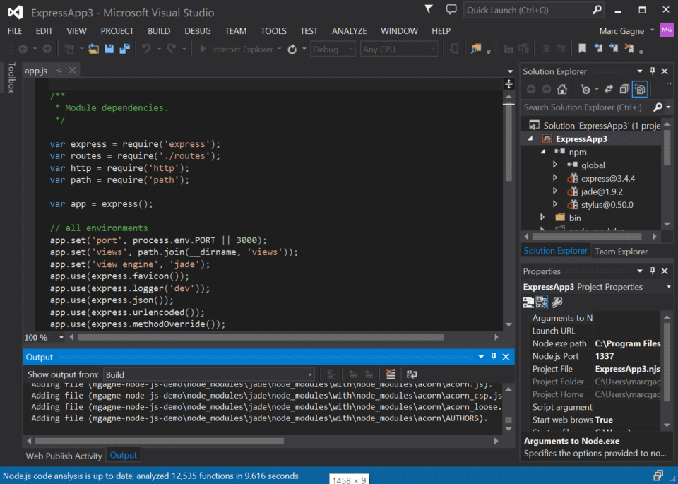

[[Home]](../../README.html)

# Visual Studio & Azure Websites

[TOC]

## Prepping your machine

### .NET Demo: Install Visual Studio

* Install Visual Studio 2013 or 2015
* If you have MSDN [download from MSDN here](https://msdn.microsoft.com/en-us/subscriptions/downloads/)
* If you do not have MSDN [download the free Community Edition](http://www.visualstudio.com/en-us/products/visual-studio-community-vs.aspx)

### Node.js Demo: Install Visual Studio 2013 & the Node.js Tools for VS

#### Install Visual Studio 2013
* If you have MSDN [download from MSDN here](https://msdn.microsoft.com/en-us/subscriptions/downloads/)
* If you do not have MSDN [download the free Community Edition](http://www.visualstudio.com/en-us/products/visual-studio-community-vs.aspx)
* Install [Node.JS Tools for Visual Studio](https://nodejstools.codeplex.com/)

#### Install Node.js for Windows

- Navigate to http://nodejs.org/
- Click `Install`
- Download & run the msi installer (accept all defaults)

## Guides

### Create & Deploy .NET app

In this demo you will create a new ASP.NET application and deploy it to a new Azure Website using webdepoy all from within Visual Studio (2013 or 2015).

1. Open Visual Studio
1. Click `File` > `New` > `Web Site`
1. Select `ASP.NET Web Site (Razor v3)` & Click `OK`
1. Compile & Run the site (`Ctrl` + `F5`)
	* *Speaker*: "So we've just created a basic ASP.NET site running locally on our machines. We will now deploy it to Azure without ever having to leave Visual Studio"
1. Close the browser
1. Right click on the website project and click `Publish Website`
1. Click `Microsoft Azure Websites`
1. *Speaker*: "You will have to log into your Azure subscription, from there you can either select to deploy to an existing website if you have already created one, or create a new one. For this demo we will start fresh with a new website."
1. Click `New`
1. Fill out the required information
	* Site name: Enter a unique name
	* Region: Select any region
	* Database server: No database
1. Click `Create`
1. *Speaker*: Visual Studio will now connect to Azure and create a new site for your application. Once that is done it will download the publishing settings for Web Deploy.
1. Click `Publish` on the `Connection` screen after the site is created.
1. Expand the Console output window to show Visual Studio is hard at work 
1. *Speaker*: "Visual Studio will now use web deploy to publish your Node.js application. Web Deploy is a technology Microsoft uses to mange deploying packages to IIS (our weberver)."
1. The site will automatically launch when complete.

### Create & Deploy Node.js app

In this demo you will briefly show that Visual Studio not only supports Node.js thanks to the the [Node.JS Tools for Visual Studio](https://nodejstools.codeplex.com/) but that you can deploy & monitor a Node.js app to Azure from within Visual Studio.

1. Open Visual Studio 2013
	* **Tip**: This works well in the free community edition, which is worth mentioning
1. Click `File` > `New` > `Web Site`
1. Under `Templates` click `JavaScript` then select `Starter Azure Node.js Express 3 Application`
1. Click `Yes` to install package dependencies
	* **Tip**: If this is your first time running through this demo it could take a minute or so to download the dependencies. If it's not working or takes too long simply right click on `npm` in your project's solution explorer & click `Install Missing npm packages`
1. Press `Ctrl` + 'F5' to build and run the app locally
1. Right click on the website project and click `Publish Website`
1. Click `Microsoft Azure Websites`
1. *Speaker*: "You will have to log into your Azure subscription, from there you can either select to deploy to an existing website if you have already created one, or create a new one. For this demo we will start fresh with a new website."
1. Click `New`
1. Fill out the required information
	* Site name: Enter a unique name
	* Region: Select any region
	* Database server: No database
		* **Optional** You can extend this demo by selecting to create a database server and showing that the creation of accounts and logging in works all without ever having to set up a database or connection string yourself in the deployed site.
1. Click `Create`
1. *Speaker*: Visual Studio will now connect to Azure and create a new site for your application. Once that is done it will download the publishing settings for Web Deploy.
1. Click `Publish` on the `Connection` screen after the site is created.
1. Expand the Console output window to show Visual Studio is hard at work 
1. *Speaker*: "Visual Studio will now use web deploy to publish your application. Web Deploy is a technology Microsoft uses to mange deploying packages to IIS (our weberver)."
1. The site will automatically launch when complete.

### Visual Studio & Server Explorer

In this demo you will briefly explore the Server Explorer tool and show how you can manage & monitor Azure from within Visual Studio.

#### Guide

1. Open Visual Studio
1. Click `View` > `Server Explorer`
1. Expand `Azure`
1. Expand `Websites`
	* **Note**: You should have some sites running to showcase some of the features of the server explorer for Azure
1. Right click on any website
1. Click `View Settings`
	* *Speaker:* "The Azure Server explorer allows you to administrate and monitor your various Azure services including Mobile Services, Notification Hubs, SQL Databases and of course Websites. In this case we are viewing the configuration for our website. We can change the logging settings, enable remote debugging, manage connection strings and more.
1. Click `Logs`
	* *Speaker:* "In the logs section we can stream live logs right to the Output window of Visual Studio or download them. If application logging was enabled we would be able to view even more diagnostics information.
1. Right click on the website again
1. Highlight the "Attach debugger" and "Attach debugger (Node.js) options"
	* *Speaker:* "Here we can attach the .NET or Node.js debugger directly to our website running on Azure allowing for "live site" debugging of production issues."
1. Expand the `Files` folder to show your applications files
	* *Speaker:* "You can even view and edit the files even if you don't have them on your local system. We don't really recommend this but it's handy if you have to make a quick live-site change."
1. * *Speaker:* "Those are just some of the things you can do with Azure & Visual Studio. For those of you more command line oriented most of this is also available via our command line interface which you can install by running `npm install azure-cli`."
