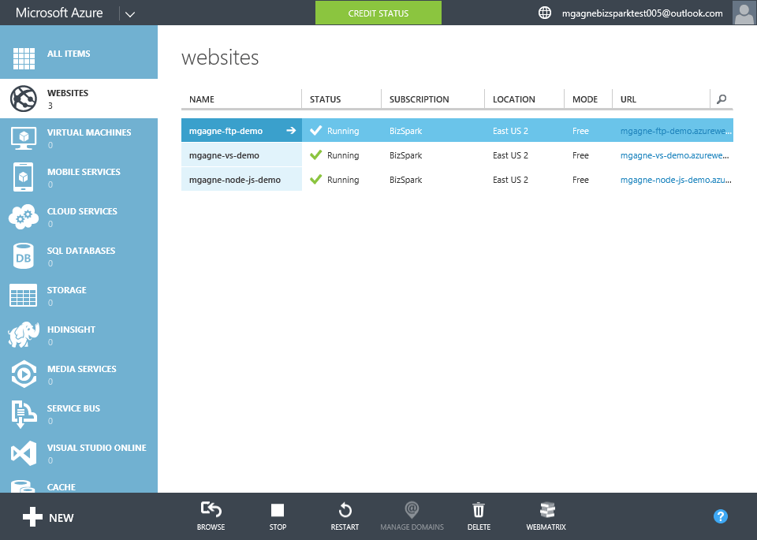

[[Home]](../../README.html)

# Scaling Azure Websites

[TOC]

This is less a "demo" then a portal overview of how to configure the three scaling scenarios which are "Manual", "Scheduled" or "Auto".

## Guide

1. Open the Azure Portal to your list of Websites
1. Open a Website
1. Click on the `Scale` tab
1. Explain the difference between the Free, Shared, Basic & Standard Web Hosting Plans
	* Web Hosting Plans can be shared across multiple websites. Each plan has a mode associated with it. Different modes expose different sets of features and capabilities. Plans in the Free and Shared modes run on a shared infrastructure with sites managed by other customers. These sites will have strict quotas for resource utilization. Plans in the Basic and Standard modes run on resources that are dedicated to your sites and have fewer restrictions.
		* The free tier is limited to 10 sites, runs on a shared server with no dedicated cpu or memory, storage is limited to 1 GB, outgoing (egress) bandwidth is limited to 165 MB per day (incoming or ingress bandwidth is free). 
		* The shared tier runs on a shared server (up to 6 of them) with dedicated cpu & memory, support custom domains and can be scaled out to up to 6 instances.
		* The basic tier websites run on VMs dedicated exclusively to a single customer's websites and includes support for SSL (at an extra cost), scaling out to up to 6 instances, and file storage of up to 20 GB of content.
		* The standard tier websites runs on VMs dedicated exclusively to a single customer's websites and includes support for SSL, scaling out to up to 10 instances, and file storage of up to 50 GB of content.
		* Features like websockets (and the number of them), traffic management, max vm instances, ssl support etc. all depend on the tier. As these are always changing it's best to refer them to http://azure.microsoft.com/en-us/pricing/details/websites
		* For questions on pricing or a feature matrix chart see [Websites Pricing](http://azure.microsoft.com/en-us/pricing/details/websites/)
1. If the site you have selected isn't already in the 'Standard' tier, change to that now (but you do not need to save it yet)
1. Scroll down to `INSTANCE SIZE`
1. *Speaker*: "Generally speaking there are two ways to scale, Up or Out. Scaling up refers to increasing the size of the system, so resources like more CPU and more RAM. Scaling Out generally referrals to adding more systems and balancing the load between them. Azure allows you to easily do both manually, by a schedule or automatically."

### Manual Scale

1. Show how to manually *scale up* by opening the `Instance Size` dropdown and showing the options
1. Show how to manually *scale out* by scrolling down to `INSTANCE COUNT` and sliding the bar to the right to increase the instance count.
	*Speaker*: "When you scale out (provision multiple instances) Azure Websites some pretty impressive magic happens. Azure not only configures the new servers for you, but also configures a load balancer to round-robin the requests across your instances, all for free! Also the backend service of Azure called Kudu monitors for updates to your site, like when you deploy new code and will automatically deploy it across all your sites."

### Scheduled Scale

1. Scroll back up to `EDIT SCALE SETTINGS FOR SCHEDULE`
	* Explain that Azure Websites allows you to define a schedule for your scaling needs.
1. Click `set up schedule times`
	* Explain that you can define times of the day or even specific days and edit the scale settings for that time period.
	* *Speaker*: "Take the example of a development environment or a reporting service. Both are likely used most during core business hours, but less so late at night. You can configure a scale settings for the day and another for the evening to save on costs."

### Autoscale

1. Scroll to `SCALE BY METRIC` option
1. Click `CPU`
	* Explain that currently Azure only supports autoscaling based on CPU
1. Scroll down to `INSTANCE COUNT`
1. Set instance count min to 2 and max to anything more than 2
	* Explain that you can set the minimum and maximum number of instances you wish Azure to configure for you based on the CPU load of your application.
	* When Scale by Metric is enabled, Microsoft Azure checks the CPU of your website once every five minutes and adds instances as needed at that point in time. If CPU usage is low, Microsoft Azure will remove instances once every two hours to ensure that your website remains performant. Generally, putting the minimum instance count at 1 is appropriate. However, if you have sudden usage spikes on your website, be sure that you have a sufficient minimum number of instances to handle the load. For example, if you have a sudden spike of traffic during the 5 minute interval before Microsoft Azure checks your CPU usage, your site might not be responsive during that time. If you expect sudden, large amounts of traffic, set the minimum instance count higher to anticipate these bursts. [more info]()