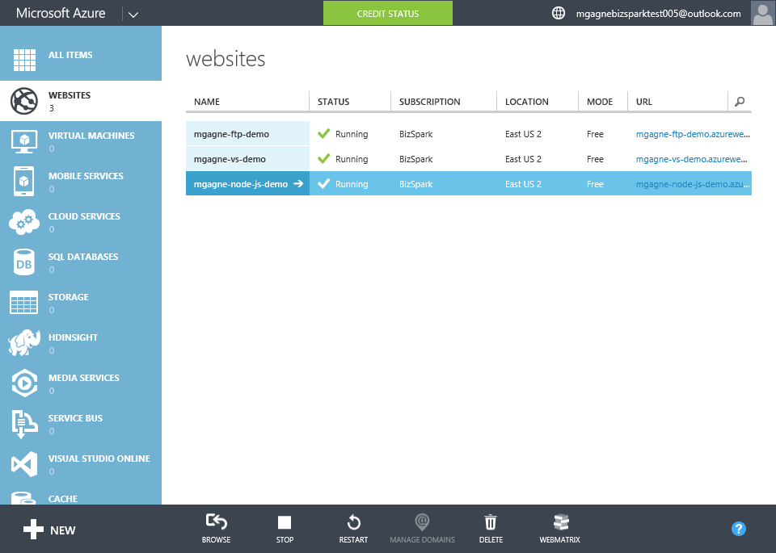

[[Home]](../../README.html)

# Azure Websites Staging

[TOC]

This demo goes over the concept of staging / deployment slots and how to swap between them.

## Guide

There are two ways to demo this. You can go through all the steps live (creating the site, defining the deployment slots, deploying to each one, swapping between the two) OR have everything pre-configured and simply explain the concept and show how easy it is to swap between the two.

1. Click `+ NEW` > `COMPUTE` > `WEBSITE` > `QUICK CREATE`
1. Enter a unique name for your site and click `CREATE WEBSITE`
1. If you haven't created this site on a Basic/Standard hosting plan you will need to upgrade it
	1. Click on `SCALE`
	1. Select `Basic` or `Standard`
	1. Click `SAVE` then `YES` to the popup
		* **NOTE*: This can take a few minutes (6+), so it's a good idea to have a web hosting plan configured for standard or basic already and create your demo site in t.
1. Click on `Add a new deployment slot` if you are in the Quick Start screen or the Dashboard
1. Enter required information
	* `NAME`: "preprod"
	* `CONFIGURATION SOURCE`: Select the name of your website
1. Expand (by clicking the right arrow) your website to show there is now 2 sites
1. Click on your main website
1. Click on `DASHBOARD` (so you can see the FTP credentials)
1. FTP upload the site found in `assets\coming-soon-demo-prod`. [Click here](../Azure Websites Creation/ftp-demo.html) to learn how to FTP deploy a site in Azure.
1. Click `BROWSE` on the site to show what it looks like
	* *Speaker*: "This is our current production site, it's not that great but the good news is the developers are hard at work on the next version. Note that the URL for this site is <your site name>.azurewebsites.net"
	* **Tip**: Do not close this tab when you are done, you will need it later!

1. Navigate back to your list of websites and click the `preprod` version of the site
1. Click on the `preprod` version of your website
1. Click on `DASHBOARD` (so you can see the FTP credentials)
1. FTP upload the site found in `assets\coming-soon-demo-preprod`. [Click here](../Azure Websites Creation/ftp-demo.html) to learn how to FTP deploy a site in Azure.
	* **Tip:** Be sure to use the proper deployment username for your `preprod` site, it is different than the one for your main site. If you don not change this you will just log into your main site.
1. Click `BROWSE` on the site to show what it looks like & compare it to the current one in production
	* *Speaker*: "This is the newest version of the site, I think it's much nicer. It's passed all tests and we are ready to swap it so it is the live site! Note the URL of this site is <your site name>-<deployment slot>.azurewebsites.net"
	* **Tip**: Do not close this tab when you are done, you will need it later!
1. Click `SWAP`
		* *Speaker*: "You can have multiple deployment slots for say dev, test, pre-production, beta & finally production. Select the source and the destination and simply click the checkmark"
1. Click `OK` (checkmark)
1. Go back to your production site browser tab and refresh the page to show that the site has changed
		* *Speaker*: "When you swap deployment slots Azure does what is called a VIP swap or Virtual IP swap, it simply changes (internally) where your slots point to so it's very fast. You can see the production site now has the latest code and if we refresh the preprod one it will have the old code ready to be updated to the current and future versions of your site/app."
