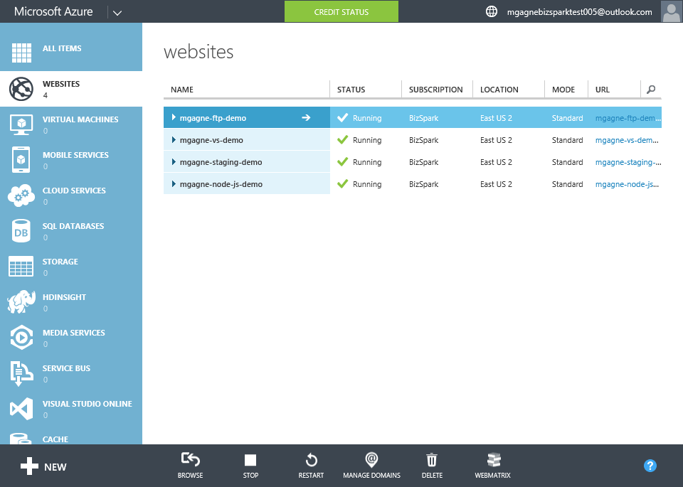

[[Home]](../../README.html)

# Azure Websites Backups

[TOC]

This is less a "demo" then a portal overview of how to configure backups for your website.

## Guide

### Create a storage account

This part is technically optional if you have already created a storage account. However you should still explain the concept of a storage account to the audience.

1. *Speaker:* "Backup your Microsoft Azure Website to a Storage Account on demand, or on a schedule you define. Use this backup to create an offline copy of this website or restore it to a previous version. To get started we will need to create a storage account."
1. *Speaker*: "Azure Storage is massively scalable, so you can store and process hundreds of terabytes of data to support the big data scenarios required by scientific, financial analysis, and media applications. Or you can store the small amounts of data required for a small business website. Wherever your needs fall, you pay only for the data you're storing. Azure Storage currently stores tens of trillions of unique customer objects, and handles millions of requests per second on average. You can select your level of redundancy, the lowest being triple redundant, so you know your data is protected!"
1. Click `+ NEW` > `DATA SERVICES` > `STORAGE` > `QUICK CREATE`
1. Enter required information
	* `URL`: Enter a globally unique name for your account
	* `LOCATION/AFFINITY GROUP`: Select one or use the default
	* `REPLICATION`: Use default
1. Click `CREATE STORAGE ACCOUNT`

### Create a website & enable backups
1. Click `+ NEW` > `COMPUTE` > `WEBSITE` > `Quick Create`
1. *Speaker*: "We will create a new test site in our hosting plan that is setup for Standard tier. Only the Standard tier supports automatic backups"
1. Enter required information
	* `URL`: a unique name for this demo site
	* `WEB HOSTING PLAN`: You will need to deploy to a **Standard** tier plan as only the standard tier supports automatic backups.
1. Click on the `BACKUPS` tab
1. Click `ON` to enable backups
1. Select your newly created storage account (or any previously created storage account)
1. *Speaker*: "Currently storage account only support daily backups."
1. *Speaker*: "If your website is linked to a database via the configurations connection string you can optionally enable database backups as well. If you are using Azure SQL Azure SQL Database it by default (and for free) includes full database backup once a week, differential database backups once a day, and transaction log backups every 5 minutes."
1. *Speaker*: "You can perform a backup any time you want simply by clicking on BACKUP NOW."
1. *Speaker*: "To restore a backup click RESTORE NOW and select the backup to restore from."